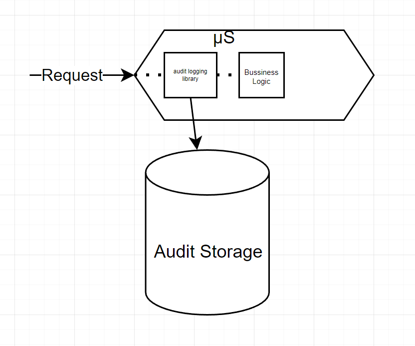

# Answers

### 1. Describe an example in which you solved a business problem with an algorithm. ( i.e. solved elevator scheduling using the C-SPAN algorithm )​

The business problem was the following:

The payroll, in the Mexican context at least, involves a lot of rules many of them change every fiscal year. Some of the changes are somehow fixed, the change involves only a different amount or percentage in a tax or adding or removing rows from tables to be evaluated.

The problem is that the rules are not always fixed, sometimes the rules change in a way that the previous rules are not valid anymore.

The good news is that the calculations always involve the same operations, sums, rests, multiplications, etc.

The company was in charge of designing a payroll system that could work with any Mexican institution and could be easily updated with the new rules. Nowadays tools like **Truffle** or the **Spring Expression Language** could be used to solve this problem, but the point is that the _Payroll System_ was made in C++ more than 20 years ago.
So the solution was creating a **Syntactic Analyzer** that could read the rules from a database and generate a **Syntax Tree** that could be evaluated to calculate the payroll.

I wasn't involved in all the design, but I was in the team to create the **Syntactic Tree** based in... well a tree. The operation was simple and it could be found in any algorithm book, but was quite satisfying to see it working.

Reference at [Aspel Noi](https://www.aspel.com.mx/noi?pag=beneficios)

### 2. What is an underutilized coding pattern? ( i.e. Abstract Factory ). Why is this pattern valuable?

This question is hard to answer because I know many applications that, in a set, use all the documented **Design Patterns**. Nonetheless I'm going to take as example the **State Machine**.

**State machine** is one of the design patterns that have the limitation of resolve a specific problem. I think is not as general as **Abstract Factory** or **Command** and its utilization could be thought as limited maybe because that many people don't mention it often.

But nowadays **State Machine** has become relevant due to its use in microservices patterns. One example is the **Orchestrated saga**.

The **Orchestrated Saga** uses a local **State Machine** located in the orchestrator to build a distributed **State Machine** where the saga is built on.

In my opinion every time an **Orchestrated Saga** is used, a **State Machine** is used too. This is a good example of how a pattern that was underutilized is now a fundamental part of the microservices architecture.

### 3. Describe a complex example in which you incorporated a 3rd party library/component.

Here the situation was the following:

Every time that a request to a microservice was done the microservice should  record **audit logs** to ensure that the institution had the data needed for any dispute.
To accomplish that the institution developed a library that every team  should add to their projects in order to automate the **audit logging**.
This was a third party library to us because the library was made in the global branch of the company, and we didn't have access to the code or even detailed documentation.

The troubles involved many things, including communication with the global branch, lack of documentation, and mainly the complexity of the approach.
The library should know what fields should be valuables to audit and what other fields should be ignored.
The library was a spring boot starter with **_AOP_** which made the debugging complex and intricate.
At the end the gathering of various teams (with the absence of the global team) to expose what they found was fundamental to clarify the functionality of the library and the preconditions and post-conditions of the library internals.  